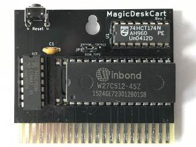

# MagicDeskCart

The MagicDeskCart is a simple bank switching cartridge for the C64/C128. It is a rendition of a ["Magic Desk"](https://csdb.dk/release/?id=132937) compatible layout. There is also no warranty whatsoever. **USE AT YOUR OWN RISK!**.

**WARNING**: In revision 1, the jumper labels have been accidentally reversed!

See my [blog post](https://www.hackup.net/2019/07/bank-switching-cartridges/) for more details.

## License
Released under GNU General Public License v3.0, see LICENSE file.
